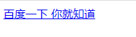

## 1.HTML
HTML(hyper text mark language)是超文本标记语言，使用标签来定义网页的内容，每一个标签可以定义文本、图片、超链接等内容。

### 认识元素
HTML是由一系列元素组成的。比如：
```html
<html>
  <head>
    <title>我是网页</title>
  </head>
  <body>
    <h1>Hello World</h1>
  </body>
</html>
```
关于元素的查询链接：[MDN Docs](https://developer.mozilla.org/zh-CN/docs/Web/HTML)

#### 元素结构
元素分为双标签元素和单标签元素。
```html
<!--  <开始标签> 内容 </结束标签> -->
<p> Hello World </p>
<meta charset="UTF-8">
```

#### 元素属性
元素也可以拥有属性。
```html
<!-- 属性名=属性值 -->
<p class="editor-node"></p>
```
有些属性是公共的，比如`class` `id` `title`。有一些是标签特有的，比如`meta`元素的`charset`属性，`img`的`alt`属性

#### 元素嵌套
元素的内容也可以是另外一个元素，即元素的嵌套。
```html
<ul>
  <li>
    <div>
      <span>aaa</span>
      <span>bbb</span>
    </div>
  </li>
  <li>
    <p>段落1</p>
  </li>
  <li>
    <p>段落2</p>
  </li>
</ul>
```
常见的元素关系为父子关系，兄弟关系。

### 常见元素
#### DOCTYPE 文档声明
HTML最上方的一段文本称为文档声明。声明该文档的类型和html版本。
```html
<!DOCTYPE html>
```
告诉浏览器当前页面是HTML5页面，让浏览器用HTML5的标准去解析识别内容，必须放在HTML文档的最前面，不能省略，省略了会出现兼容性问题。

#### html 元素
表示一个HTML文档的根元素。其他所有元素是html元素的后代。
```html
<html lang="en">
  ...
</html>

属性：
lang: en=英文，zh-CN=中文
  - 帮助语音合成工具确定要使用的发音
  - 帮助翻译工具正确翻译
```

#### head 元素
规定文档相关的配置信息，也称之为元数据。包括文档标题、网页编码、引用的文档央视和脚本。
```html
<head>
  <!-- 网页字符编码 -->
  <meta charset="UTF-8">
  <meta http-equiv="X-UA-Compatible" content="IE=edge">
  <meta name="viewport" content="width=device-width, initial-scale=1.0">
  <!-- 网页标题 -->
  <title>Document</title>
</head>
```

#### body 元素
在浏览器中看到的内容都是在body元素中。
```html
<!DOCTYPE html>
<html lang="en">
<head>
  <meta charset="UTF-8">
  <meta http-equiv="X-UA-Compatible" content="IE=edge">
  <meta name="viewport" content="width=device-width, initial-scale=1.0">
  <title>Document</title>
</head>
<body>
  <p>这是一个段落</p>
</body>
</html>
```

#### h 元素
标记网页的标题。
```html
<body>
  <h1>我是h1标题</h1>
  <h2>我是h1标题</h2>
  <h3>我是h1标题</h3>
  <h4>我是h1标题</h4>
  <h5>我是h1标题</h5>
  <h6>我是h1标题</h6>
</body>
```


#### p 元素
标记一段文本为段落。
```html
  <p>勇于自我革命是中国共产党最鲜明的政治品格，全面从严治党是新时代党的自我革命的伟大实践。新时代以来，以习近平同志为核心的党中央坚持打铁必须自身硬，以前所未有的勇气和定力推进全面从严治党，以坚如磐石的意志正风肃纪反腐，党极大增强了自我净化、自我完善、自我革新、自我提高能力，找到了自我革命这一跳出治乱兴衰历史周期率的第二个答案</p>
  <p>全面建设社会主义现代化国家、全面推进中华民族伟大复兴，关键在党。我们党作为世界上最大的马克思主义执政党，要始终赢得人民拥护、巩固长期执政地位，必须时刻保持解决大党独有难题的清醒和坚定。党的二十大再次警示全党，“四大考验”“四种危险”将长期存在；要求全党必须牢记，全面从严治党永远在路上，党的自我革命永远在路上。这体现了我们党对严峻复杂考验的清醒认识，要求我们党必须始终保持勇于自我革命的政治品格和顽强意志，补钙壮骨、排毒杀菌、壮士断腕、去腐生肌，不断清除侵蚀党的健康肌体的病毒，不断提高自身免疫力，永葆先进性纯洁性。</p>
```


#### img 元素
告诉浏览器显示一张图片，需要指定图片的源，可以是相对路径，也可以是网络链接。
```html


属性：
  src: 图片路径，相对路径或url
  alt: 当图片加载出错是显示的文字，帮助屏幕阅读器
```


#### a 元素
定义一个锚点，可以跳转到另外的链接，也可以在跳转到本页面相应的位置。
```html
<a href="https//www.baidu.com" target="">百度一下 你就知道</a>

属性：
  href: 超文本链接，要跳转的位置，可以是url、id、本地网页相对路径
  target: 目标
    - _self(默认值): 在当前页面打开
    - _blank: 在新的页面打开
```

a元素也可以实现锚点链接，跳转到网页中的具体位置。
```html
<body>
  <!-- 
    页面内的锚点效果：
    1. 在跳转的元素上添加id
    2. 定义a元素，在href中指向id
   -->
  <h1 id="header1"> 标题1 </h1>
  ...
  ...
  <a href="#header1">标题1</a>
</body>
```
a元素的内容可以是另外一个元素，比如常用的是img元素。

#### iframe 元素
可以实现在一个html文档中嵌套另外一个html文档。
```html
<iframe src="http://www.taobao.com" frameborder="0"></iframe>
```


#### div span 元素
定义一个块元素，可以把它们当作容器。这两个元素无所用，无所不用。理论上，页面可以没有div、span。也可以都是div、span。
- `div元素` 多个div元素包裹的内容会在不同的行显示，一般作为其他元素的父容器，把其他元素包住，作为一个整体。
- `span元素` 多个span元素包裹的内容会在同一行显示，默认情况下跟普通文本几乎没有差别，用于区分特殊文本和普通文本。

```html
<style>
  .area {
    border: 1px solid red;
  }
  .keyword {
    font-size: 30px;
  }
</style>

<h1>学习前端</h1>
<div class="area">
  <h2>学习HTML + CSS</h2>
  <p>
    学习 <span class="keyword">HTML</span>的元素，学习<span class="keyword">CSS</span>的编写式
  </p>
</div>

<div class="area">
  <h2>学习JavaScript</h2>
  <p>
    学习<span class="keyword">JavaScript</span>的基本语法 ， <span class="keyword">BOM/DOM<span> 。。。
  </p>
</div>

<div class="area">
  <h2>学习工具</h2>
  <p>
    node/nmp/...
  </p>
</div>
```
这个例子中，用div把每个小标题都包裹成一个整体，方便施加统一的样式，用span把关键字给标识出来。

### 常用的全局属性
- `id` 定义位移的标识符(ID)，该标识符在整个文档中必须是唯一的。其目的是在链接、脚本或样式(使用CSS)时标识元素。
- `class` 一个以空格分隔的元素的类目列表，它允许CSS和Javascript通过类选择器或者DOM方法来选择和访问特定的元素。
- `style` 给元素添加内联样式。
- `title` 包含标识与其所属元素相关信息的文本。这些信息通常可以作为提示呈现给用户，但不是必须的。


### URL
URL代表着是统一资源定位符，就是给定的一个资源的路径。URL的标准格式为：
```console
[协议类型]://[服务器地址]:[端口号]/[文件路径][文件名]?[查询]#[片段ID]

协议类型：通讯协议，http，https，ftp...
服务器地址：可以是IP地址，也可以是域名
端口号: http默认是80，https默认是443
文件路径: 资源在服务器上的路径
文件名: 资源名称
查询: 查询字符串，传递额外参数给服务器
片段: 相当于锚点
```
