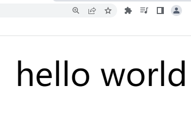

## 2.CSS

### 认识CSS
CSS标识层叠样式表(Cascading Style Sheet)，是为网页添加样式的代码。早期的网页都是通过HTML来编写的，但是也希望HTML页面可以更加丰富。早期时候增加了很多具备特殊样式的元素，比如i、strong、del等等。后来有不同的浏览器实现各自的样式语言，没有统一的标准。经过多年的发展，现在的网页主要是HTML实现结构，然后CSS负责美化。

### 引入CSS
有三种方式可以将CSS样式应用到元素上。

#### 内联样式
将样式存在于HTML的style属性之中。
```html
  <div style="color: red; font-size: 50px;">我是div元素</div>
  <h1 style="font-size: 30px;">我是标题1</h1>
```

在原生的HTML编写过程中，这种方式是不推荐的。但是在一些框架中，比如vue，这种方式很常见。
#### 内部样式表
如果一个元素的CSS样式过多，内联样式的方式就过于臃肿了。可以将这些CSS样式抽离出来，放在head标签中。
```html
  <!-- 放在head标签中 -->
  <style>
    /* 类选择器 */
    .div1 {
      color: red; 
      font-size: 50px;
    }
    .h1 {
      font-size: 30px;
    }
  </style>
  <!-- 放在body标签中 -->
  <div class="div1">我是div元素</div>
  <h1 class="h1">我是标题1</h1>
```

#### 外部样式表
将CSS文件抽离成一个单独的文件，在HTML中再引入该文件。在test.css中写CSS代码：
```css
/* 类选择器 */
.div1 {
  color: blue; 
  font-size: 50px;
}
.h1 {
  font-size: 50px;
}
```
然后再test.html中的head标签中引入：
```html
  <link rel="stylesheet" href="./test.css">
```


### 常见CSS
相关文档网站：
> [https://www.w3.org](https://www.w3.org)
> [https://developer.mozilla.org/en-US/docs/Web/CSS](https://developer.mozilla.org/en-US/docs/Web/CSS)

#### 字体大小 font-size
```html
  <style>
    .title {
      font-size: 36px;
    }
  </style>

  <div class="title">hello world</div>
```

#### 颜色 color
设置前景色，包括文字、装饰线、边框、外轮廓等元素。
```html
  <style>
    .title {
      font-size: 36px;
      color: red;
    }
  </style>

  <div class="title">hello world</div>
```


#### 背景颜色 background-color
```html
  <style>
    .title {
      font-size: 36px;
      color: red;
      background-color: black;
    }
  </style>

  <div class="title">hello world</div>
```

#### 宽度 高度 width height
```html
  <style>
    .title {
      font-size: 36px;
      color: red;
      background-color: black;
      width: 240px;
      height: 80px;
    }
  </style>

  <div class="title">hello world</div>
```


### 文本属性
#### 文本装饰 text-decoration
用于修饰文本的装饰线，常有以下取值
- `none` 不设置任何装饰线，常用于取消a标签的下划线。
  ```html
    <style>
    .a_elem {
      text-decoration: none;
    }
    </style>

    <body>
    <a href="http://www.baidu.com" class="a_elem">百度一下</a>
    </body>
  ```
  
- `underline` 设置下划线。
  ```html
    <style>
    .design {
      text-decoration: underline;
    }
    </style>

    <span class="design">百度一下</span>
  ```
  
- `line-through` 设置划过字体的线。
  ```html
    <style>
    .design {
      text-decoration: line-through;
    }
    </style>

    <span class="design">百度一下</span>
  ```
  
#### 大小写转换 text-transform
- capitalize 使文本首字母大写
  ```html
    <style>
    .design {
      text-transform: capitalize;
    }
    </style>

    <span class="design">hello world</span>
  ```
  
- uppercase 将每个字母变成大写
    ```html
    <style>
    .design {
      text-transform: uppercase;
    }
    </style>

    <span class="design">hello world</span>
  ```
  
- lowercase 将每个字母变成小写
  ```html
    <style>
    .design {
      text-transform: lowercase;
    }
    </style>

    <span class="design">HEllo WorLD</span>
  ```
  
#### text-align
设置行内内容(例如文字)相对它的块父元素对齐，它定义的是`行内元素`的对齐方式，对`块级元素`不起作用，常用的值:
- `left` 左对齐
  ```html
    <style>
    .design {
      text-align: left;
    }
    </style>
    <div class="design">hello world</div>
  ```
  
- `right` 右对齐
  ```html
    <style>
    .design {
      text-align: left;
    }
    </style>
    <div class="design">hello world</div>
  ```
  
- `center` 正中间显示
    ```html
    <style>
    .design {
      text-align: center;
    }
    </style>
    <div class="design">hello world</div>
  ```
  
#### word/letter-spacing
设置字母与字母之间的空间。
```html
  <style>
    .design {
      /* 设置字母与字母间的距离 */
      letter-spacing: 10px;
      /* 设置单词与单词间的距离 */
      word-spacing: 30px;
    }
  </style>

  <div class="design">hello world</div>
```


### 字体属性
#### font-size

#### font-family

#### font-weight

#### line-height

