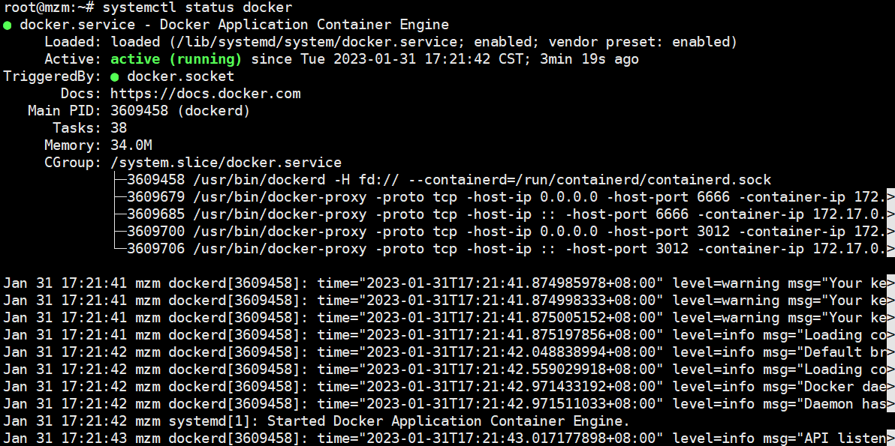

## Docker安装

### 1.介绍
- Docker的英文本意是“搬运工”，在程序员的世界里，Docker搬运的是集装箱（Container），集装箱里装的是任意类型的App，开发者通过Docker可以将App变成一种标准化的、可移植的、自管理的组件，可以在任何主流系统中开发、调试和运行。最重要的是，它不依赖于任何语言、框架或系统。
- 目标是实现轻量级的操作系统虚拟化解决方案
- 基础：Linux 容器（ LXC）
- Go 语言实现

#### 1.1 Docker组成
`Docker Images`：Docker image 是 Docker container 最基本的模板。image 通过容器使系统和应用易于安装，Docker image 是用来运行的容器，可以在 https://hub.docker.com/找到许多 images 。

`Docker Registry`：Docker registry 是为 Docker images 提供的库。它提供了公共和私有库。公共 Docker 库被叫做 Docker Hub。这里我们能够上传 push 和 pull 我们自己的 images。

`Docker Container`：Container是在原先的Image之上新加的一层，称作Container layer，这一层是可读可写的（Image是只读的）。Docker 是一个联合的文件系统作为容器后台，容器的任何变化，都将被保存在一个基本 image 新的层上。我们安装应用程序的层就是容器。每个在主机上运行的容器都是独立的，因此，提供了一个安全的应用平台。

#### 1.2 虚拟机和容器的区别
##### 1.2.1 虚拟化


##### 1.2.2 容器化技术

##### 1.2.3 虚拟化技术和容器化技术对比
|特性|虚拟机|容器|
|---|-----|-----|
|硬盘空间|GB级别|MB级别|
|启动|分钟级|秒级|
|资源消耗|很大，单机一般几十个VM，硬盘使用一般为GB|很小，单机支持上千个容器，硬盘使用一般为MB|
|隔离性|强|弱|
|镜像大小|几百MB到几G|可小至几MB|
|性能|通过对硬件层的模拟，增加了系统调用链路的环节，有性能损耗|共享内核，接近原生，几乎没有性能损耗|
|系统覆盖|Linux、Windows、Mac|内核所支持的OS|

#### 1.3 Docker应用场景
- Web 应用的自动化打包和发布。
- 自动化测试和持续集成、发布。
- 在服务型环境中部署和调整数据库或其他的后台应用。
- 从头编译或者扩展现有的 OpenShift 或 Cloud Foundry 平台来搭建自己的 PaaS 环境。

### 2. Ubuntu20.04安装Docker-CE社区版
#### 2.1 更新现有包列表
```bash
sudo apt update
```


#### 2.2 安装依赖包
```bash
sudo apt -y install apt-transport-https ca-certificates curl software-properties-common
```


#### 2.3 将官方Docker库的GPG公钥添加到系统中
```bash
curl -fsSL https://download.docker.com/linux/ubuntu/gpg | sudo apt-key add -
```


#### 2.4 将Docker库添加到APT里
```bash
sudo add-apt-repository "deb [arch=amd64] https://download.docker.com/linux/ubuntu focal stable"
```


#### 2.5 再次更新现有包列表
```bash
sudo apt update
```


#### 2.6 查看Docker库的版本
```bash
apt-cache policy docker-ce
```

输出显示，docker-ce还没有安装。

#### 2.7 开始安装
> 本次实验默认安装最新版Docker，如果你想执行下载某个版本，可以通过在软件包名后面添加版本=来指定安装版本，比如指定安装5.20.10.6~3-0，则安装指令为：
>sudo apt -y install docker-ce=<5:20.10.7~ 3-0~ubuntu-focal> docker-ce-cli=<5:20.10.7~ 3-0~ubuntu-focal> containerd.io
```bash
sudo apt -y install docker-ce docker-ce-cli containerd.io
```
安装这三个程序的作用：
- `docker-ce`：Docker守护进程，这是执行所有管理工作的部分，在Linux上需要另外两个守护进程。
- `docker-ce-cli`：CLI工具来控制守护程序，如果要控制远程Docker守护程序，你也可以单独安装它们。
- `containerd.io`：守护进程与OS API连接，从本质上将Docker与OS分离，还为非Docker容器管理器提供容器服务


#### 2.8 查看运行状态
```bash
systemctl status docker
```

到此就安装成功了。

#### 2.9 设置开启自启Docker
##### 2.9.1 docker自启动（开机启动）
```bash
systemctl enable docker.service
```
##### 2.9.2 关闭开机自动启动
```bash
systemctl disable docker.service
```
##### 2.9.3 查看开机启动的程序
查看开机启动的程序中是否有`docker`
```bash
systemctl list-unit-files | grep enable | grep docker
```

### 3 安装docker-compose
> 安装环境 Ubuntu 20.04

#### 3.1 官网安装
##### 3.1.1 下载docker-compose
```bash
sudo curl -L "https://github.com/docker/compose/releases/download/1.25.0/docker-compose-$(uname -s)-$(uname -m)" -o /usr/local/bin/docker-compose
```
但在国内下载速度很慢建议镜像下载
```bash
curl -L https://get.daocloud.io/docker/compose/releases/download/1.29.2/docker-compose-`uname -s`-`uname -m` > /usr/local/bin/docker-compose
```
##### 3.1.2 添加可执行权限
```bash
sudo chmod +x /usr/local/bin/docker-compose
```
##### 3.1.3 将文件软链接到 /usr/bin/目录下
```bash
sudo ln -s /usr/local/bin/docker-compose /usr/bin/docker-compose
```
##### 3.1.4 查看版本
```bash
docker-compose --version
```

### 4. 首次使用
> 首次使用需要添加一下镜像源

#### 4.1 创建配置文件
在`/etc/docker/daemon.json`文件添加镜像源，如果没有该文件则新建一个。
```bash
su && mkdir -p /etc/docker/ && cd /etc/docker/ && touch daemon.json && echo {\"registry-mirrors\":[\"https://docker.mirrors.ustc.edu.cn\"]} >> daemon.json
```
这里是中科大的镜像源。
#### 4.2 加载配置&&重启docker
```bash
systemctl daemon-reload  # 重新加载配置
systemctl restart docker  # 重启docker服务
```

### 5 安装Docker服务
已经安装完Docker、docker-compose了，就可以开始安装Docker服务了，比如，我这里安装一个Docker web控制面板portainer为例。
#### 5.1 下载portainer镜像
在运行portainer程序前，我们需要下载portainer镜像，就类似我们在使用某个APP时，要下载安装包，然后安装软件才能使用。
```bash
docker pull portainer/portainer
```


#### 5.2 运行容器
运行容器，类似用安装包安装软件一样，安装完后自动启动这个portainer容器，一个容器可以当做是一个或多个服务来理解，因为有些容器里面有运行多个服务的。
```bash
docker run -d --name portainerUI -p 9000:9000 -v /home/docker/portainer/docker.sock:/var/run/docker.sock portainer/portainer
```
解释：
- -d：该服务在后台运行
- --name：给该容器起一个名字
- -p：定义端口映射。主机端口:容器端口
- -v：数据卷挂载。主机路径:容器路径
- portainer/portainer：你要运行的镜像名。

一般这几个参数是建议加的，也可以不加，不加的话，对应的功能就没有办法使用，比如不加-p，想从外网访问该容器的服务器，就没有办法访问了，因为这个端口就类似一条通道，放开该通道给外网访问，不作端口映射，表示不添加这条通道，外网就找不到这条通道了。

> 在作端口映射时，记得给主机开放端口。


### 6. Docker操作
#### 6.1 查看容器、镜像
> 由于Docker的容器ID、镜像ID比较长，我们在使用到容器ID、镜像ID时，可以输入ID的前面几位，一般大于2位以上来替代完整的ID。

##### 6.1.1 查看Docker全部镜像
```bash
docker images
```
##### 6.1.2 查看Docker已启动的服务
```bash
docker ps
```
##### 6.1.3 查看Docker全部容器
```bash
docker ps -a
```
#### 6.2 启动容器
启动容器是指已经创建好的容器，但已经停止该容器，还没删除的容器，此时可以重启该容器，类似手机开关机。

停止、重启容器有两个方式，一个是通过指定容器ID，一个方式是指定容器名，即CREATED
##### 6.2.1 查看容器ID
```bash
docker ps -a
```
启动容器可一次性启动一个容器或多个容器。
##### 6.2.2 指定容器ID启动
```bash
docker start 容器ID [容器ID]
```
##### 6.2.3 指定容器名启动
```bash
docker start 容器名 [容器名]
```
#### 6.3 停止容器
##### 6.3.1 指定容器ID
```bash
docker stop 容器ID
```
##### 6.3.2 指定容器名
```bash
docker stop 容器名
```
##### 6.3.3 停止正在运行的全部容器
```bash
docker stop $(docker ps -a -q)
```
#### 6.4 重启容器
##### 6.4.1 指定容器ID
```bash
docker restart 容器ID
```
##### 6.4.2 指定容器名
```bash
dockre restart 容器名
```

#### 6.5 删除容器
删除容器三步法：
1. 查看容器ID：docker ps -a
2. 停止容器：docker stop 容器ID
3. 删除容器：docker rm 容器ID

```bash
# 查看容器
docker ps -a
```
```bash
# 停止容器
docker stop 容器ID
```
```bash
# 删除容器
docker rm -f 容器ID [容器ID]
```
- -f：表示停止该容器并删除
- 容器ID：可以输入前几位即可或者完整ID

删除所有已经停止的容器
```bash
docker rm $(docker ps -a -q)
```

#### 6.6 删除镜像
因为容器是基于镜像运行起来的，如果要删除镜像，表面你也不需要这个服务了，那该镜像产生的容器也应该要删除掉，这样可以减少多余的垃圾对服务器的影响。

总的来说，应先删除容器，再删除镜像。
#### 6.6.1 通过ID删除镜像
```bash
docker rmi IMAGEID # 使用镜像ID删除镜像
docker rmi 0e901e68141f # 删除镜像
docker rmi 0e9 #或者使用简短的ID前三位
```
#### 6.6.2 通过TAG删除镜像
```bash
docker rmi REPOSITORY:TAG # 删除镜像样例
docker rmi nginx:latest # 删除镜像
docker images # 查看镜像
```
`rm`参数含义
- `-f` : 通过 SIGKILL 信号强制删除一个运行中的容器。
- `-l` : 移除容器间的网络连接，而非容器本身。
- `-v` : 删除与容器关联的卷。

### 7 查看Docker容器日志
```bash
docker logs [OPTIONS] CONTAINER(容器名)
```
OPTIONS(可选参数)：
- --details：显示更多的信息
- -f：跟踪实时日志
- --since：显示自某个timestamp之后的日志，或相对时间，如42m（即42分钟）
- --tail ：从日志末尾显示多少行日志， 默认是all
- -t：显示时间戳
- --until：显示自某个timestamp之前的日志，或相对时间，如42m（即42分钟）

#### 实战案例
**查看指定时间后的日志，只显示最后100行**
```bash
docker logs -f -t --since="2022-11-06" --tail=50 容器ID
```
**查看最近30分钟的日志**
```bash
docker logs --since 30m 容器ID
```
**查看某时间之后的日志**
```bash
docker logs -t --since="2022-11-06T13:23:37" 容器ID
```
**查看某时间段日志**
```bash
docker logs -t --since="2022-11-05T13:23:37" --until "2022-11-06T12:23:37" 容器ID
```
### 8 使用docker-compose创建容器
#### 8.1 新建一个docker-compose.yml文件
一般建议在/home/docker/下新建一个文件夹来存储每个Docker服务的数据。
```bash
mkdir -p /home/docker/portainer/
cd /home/docker/portainer/
vi docker-compose.yml
```
#### 8.2 编写docker-compose.yml
```yaml
version: '3.1'
services:
  portainer:   # 服务名称
    image: portainer/portainer  # 镜像版本 默认最新
    restart: always  # 启动方式
    container_name: portainer #容器名称
    volumes: # 本机路径：容器路径,这里我使用相对路径
      - ./docker.sock:/var/run/docker.sock
    ports: # 端口映射，本机端口：容器端口
      - 9000:9000
```
#### 8.3 启动服务
```bash
docker-compose up -d
```
- up：启动程序服务
- -d：在后台运行

#### 8.4 关闭服务
如果需要关闭该服务，则进入docker-compose.yml父目录下，执行
```bash
docker-compose down
```
#### 8.5 更新服务
如果在启动完服务之后有需要修改某些服务的配置时，可以直接对`docker-compose.yml`修改，修改完之后，关闭服务(关闭服务，表示销毁该容器，如果容器内数据需要备份，则应先复制出来宿主机)，再重新启动服务即可。

### 9 创建容器并运行命令
```bash
docker run [OPTIONS] IMAGE [COMMAND] [ARG...]
```
OPTIONS参数含义说明：
- -a stdin: 指定标准输入输出内容类型，可选 STDIN/STDOUT/STDERR 三项；
- -d: 后台运行容器，并返回容器ID；
- -i: 以交互模式运行容器，通常与 -t 同时使用；
- -P: 随机端口映射，容器内部端口随机映射到主机的端口
- -p: 指定端口映射，格式为：主机(宿主)端口:容器端口
- -t: 为容器重新分配一个伪输入终端，通常与 -i 同时使用；
- --name="nginx-lb": 为容器指定一个名称；
- --dns 8.8.8.8: 指定容器使用的DNS服务器，默认和宿主一致；
- --dns-search example.com: 指定容器DNS搜索域名，默认和宿主一致；
- -h "mars": 指定容器的hostname；
- -e username="ritchie": 设置环境变量；
- --env-file=[]: 从指定文件读入环境变量；
- --cpuset="0-2" or --cpuset="0,1,2": 绑定容器到指定CPU运行；
- **-m :**设置容器使用内存最大值；
- --net="bridge": 指定容器的网络连接类型，支持 bridge/host/none/container: 四种类- 型；
- --link=[]: 添加链接到另一个容器；
- --expose=[]: 开放一个端口或一组端口；
- --volume , -v: 绑定一个卷